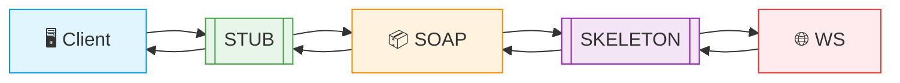

# Web Service basé sur SOAP pour la Gestion Bancaire

  
 


Un service web SOAP simple pour les opérations bancaires de base, déployé avec JAX-WS.

## 📋 Fonctionnalités

Le service web offre trois opérations principales :

- **Conversion de devises** : Convertir un montant de l'euro au dirham marocain (DH)
- **Consultation de compte** : Obtenir les détails d'un compte bancaire spécifique
- **Liste des comptes** : Récupérer une liste de comptes bancaires

## 🛠️ Structure du Projet

### Dépendances (pom.xml)
   - Spring Boot Starter
   - JAX-WS RI (Runtime Implementation)
### Classes Principales

1. **`BanqueService`** - La classe principale du service web


Le service utilise les annotations standard JAX-WS (@WebService, @WebMethod, @WebParam)


2. **`Compte`** - Modèle de données pour un compte bancaire


4. **`ServerJWS`** - Classe de déploiement du service


   - 📊 Schéma XML : Le WSDL généré décrit : La structure des données, les paramètres d'entrée/sortie, les opérations disponibles, et les liaisons SOAP.

## 🚀 Déploiement

- On lancer le serveur
- Le service est disponible à l'adresse : http://localhost:9090/
- Le WSDL peut être consulté via : http://localhost:9090/BanqueWS?wsdl


### 🔍 Test du Service
Avec un navigateur : Consultez le WSDL via l'URL ci-dessus pour analyser la structure du service
Avec SoapUI : Créez un nouveau projet SOAP, Importez le WSDL
Testez les opérations : ConversionEuroToDirham, getCompte, listComptes


Structure du projet SoapUI :


Requete 1 ConversionEuroToDirham (input et output)


Requete 2 getCompte (input et output)


Requete 3


# Module Java client-ws dans le projet client-soap-java

## Configuration et dépendances
On applique les mêmes dépendances que l'application `soap-ws` au projet `client-soap-java`.  
Les principales dépendances incluent :
- **JAX-WS** (Java API for XML Web Services) pour la communication SOAP
- Outils de génération de proxy (`wsimport`)

## Génération du proxy client
Un proxy est un ensemble de classes permettant à l'application Java de communiquer avec le web service.  

## Architecture et fonctionnement
- JAXB (Java Architecture for XML Binding) : Utilisé pour le mapping objet-XML (OXM), permettant la conversion/sérialisation/désérialisation transparente entre Java et XML.

- Modèle POO simplifié :
  Le client interagit via un proxy (STUB) généré à partir du WSDL, qui communique avec le proxy côté serveur (SKELETON).
  Cette couche middleware abstrait les complexités réseau (sockets, protocoles).

## Exemple de code client
``` java
// Exemple basique de consommation du service
public class ClientBanqueWS {
    public static void main(String[] args) {
        BanqueWS service = new BanqueWSService().getBanqueWSPort();
        double result = service.conversionEuroToDH(100);
        System.out.println("100 EUR = " + result + " DH");
    }
}
```

## Schéma de communication
## Architecture SOAP - Flux de communication


